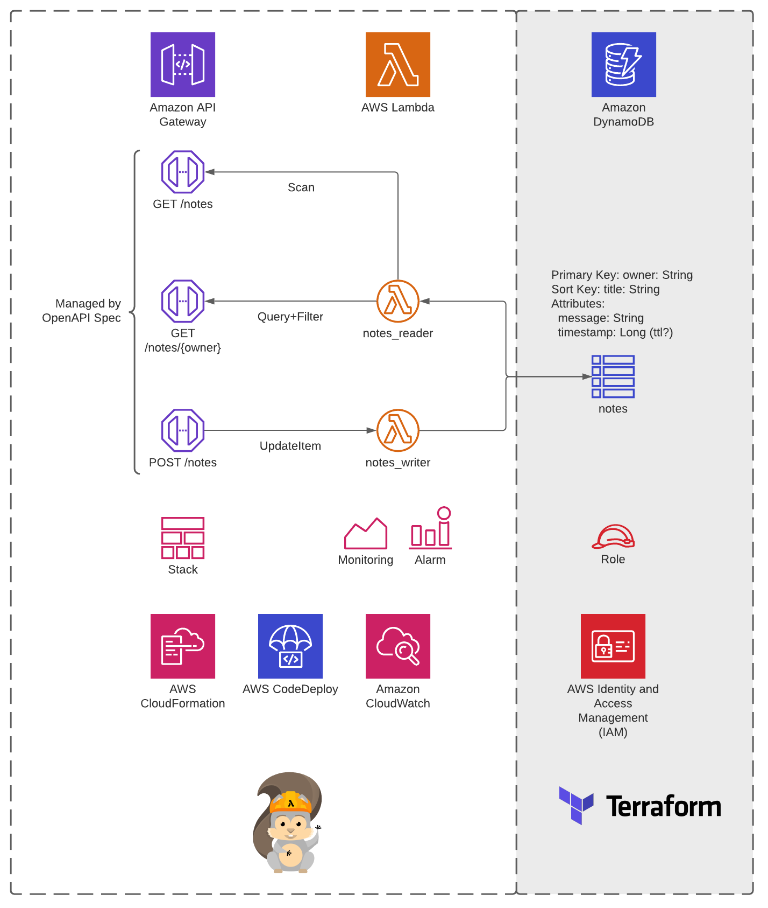

# :bulb: Tweek Week 2021

Using AWS SAM to develop serverless applications in AWS.

```bash
.
├── Dockerfile                    <-- Used to build SAM
├── Makefile                      <-- Make to automate build
├── README.md                     <-- this instructions file
├── bin                           <-- Helper scripts
├── deploy_hook                   <-- Lambda function for CodeDeploy
├── docker-compose-acceptance.yml <-- Docker Compose file for acceptance tests
├── docker-compose.yml            <-- Docker Compose file for local development
├── internal                      <-- Go module shared between lambdas
├── local                         <-- Files for SAM configuration
├── notes_reader                  <-- Lambda function code
├── notes_writer                  <-- Lambda function code
├── reference                     <-- OpenAPIv3 specification
├── samconfig.toml                <-- Configuration file for AWS SAM
├── template.yaml                 <-- Stack template for AWS SAM
└── terraform                     <-- Terraform modules
```

## Summary

The purpose of this project is to demonstrate how to use
[AWS SAM](https://docs.aws.amazon.com/serverless-application-model/latest/developerguide/what-is-sam.html)
to develop testable serverless applications as well as deploy consistently to AWS.  It is also intended to show how to
split responsibility for Infrastructure-as-Code (IAC) between AWS CloudFormation (SAM) and Terraform.

## What we are building

This repo contains a simple Serverless application that allows you to create and read "Notes".

* (2) AWS Lambdas to perform read and write operations
* A DynamoDB table to store Notes
* A REST API in APIGateway to invoke the Lambdas
* A CodeDeploy pipeline that performs a Blue/Green deployment, and includes a custom Lambda function to test the
release before sending traffic
* Alerts and monitoring with AWS CloudWatch
* Terraform and AWS CloudFormation to manage the infrastructure



## Requirements

* AWS CLI already configured with Administrator permission
* AWS-Okta configured
* [Docker installed](https://www.docker.com/community-edition)
* [Docker-Compose installed](https://docs.docker.com/compose/install/)
* [Golang](https://golang.org)
* SAM CLI - [Install the SAM CLI](https://docs.aws.amazon.com/serverless-application-model/latest/developerguide/serverless-sam-cli-install.html)
* Terraform CLI - [Install Terraform](https://www.terraform.io/downloads.html)

## Local Development

### Unit Tests

Unit tests can be run in the standard Go fashion:

```bash
go test [flags] ./...
```

### Integration Tests

The `internal/ddb` module contains integration tests for the DynamoDB client wrapper.
These were written using [TestContainers](https://golang.testcontainers.org/) and utilize Docker to simulate
actual dependencies.

```bash
go test -tags=integration [flags] ./...
```

### Acceptance Tests

The `notes_writer` function contains an acceptance test which will deploy the function code in to a Docker container
running AWS Lambda and will also run a DynamoDB Docker container.  The tests exercise the function code through the
AWS Lambda API, closely emulating the experience in AWS.

```bash
sam build
go test -tags=acceptance [flags] ./...
```

### Using AWS SAM

One of the benefits of AWS SAM is that it can emulate AWS API Gateway, Lambda, and Step Functions by running Docker
containers on the host machine.  This means you can do something like:

```bash
sam build
sam local start-api --debug --env-vars local/env.json
```

Then you can make REST API calls to `http://localhost:3000` and SAM will emulate API Gateway invoking your Lambda.
You can read more about testing and developing with AWS SAM in the
[SAM Documentation](https://docs.aws.amazon.com/serverless-application-model/latest/developerguide/serverless-test-and-debug.html).

## Deployment

AWS SAM includes a transformation tool for AWS CloudFormation.  This allows it to deploy its own infrastructure in to AWS.
However, Terraform is also an infrastructure-as-code tool and is something that most development teams are familiar with.

This project shows how we can split the responsibility for infrastructure: using AWS SAM for what it is good at, and
using Terraform for everything else.

In this case, SAM has special transforms under the `AWS::Serverless` resource definition for Lambdas, Step Functions,
and APIs.  Therefore, we are using SAM to deploy those services, and allowing Terraform to manage DynamoDB and IAM roles.

You can read more about the SAM resources available in the 
[documentation here](https://docs.aws.amazon.com/serverless-application-model/latest/developerguide/sam-specification.html).

### Terraform

The Terraform modules are located in the `terraform` directory.  Under that directory the reusable modules are in the
`modules` directory, and the deployment files are in the directory `us-east-2`.  This is a structure that I have used
in the past so that I can have tighter control over the resources that are generated in each region.  It is however not
a requirement for Terraform and can be restructured as needed.

There is a file `terraform.tfvars` that acts as the configurable input when running the Terraform in `us-east-2`.

You can run Terraform from the `terraform/us-east-2` directory with a command:

```bash
# profile is the appropriate profile for AWS-Okta
aws-okta exec "${profile}" -- terraform init
```

### AWS SAM

The SAM CLI tool depends on two files to function: `template.yaml` to describe the infrastructure we are asking SAM to
manage, and `samconfig.toml` to store deployment configurations.

You can find in-depth information deploying projects with SAM in the 
[documentation here](https://docs.aws.amazon.com/serverless-application-model/latest/developerguide/serverless-deploying.html).

I wrote some simple shell functions in the `bin` directory.  **Note that these will need to be edited depending on your
individual aws-okta configuration.**

As an example to validate the SAM template:

```bash
./bin/sam-validate.sh
```

An example to deploy the stack.  This includes the `--guided` flag which is not CI friendly but great for local work.

```bash
./bin/sam-deploy.sh {stack_name}
```

The command will package and deploy your application to AWS, with a series of prompts:

* **Stack Name**: The name of the stack to deploy to CloudFormation. This should be unique to your account and region,
and a good starting point would be something matching your project name.
* **AWS Region**: The AWS region you want to deploy your app to.
* **Confirm changes before deploy**: If set to yes, any change sets will be shown to you before execution for manual
review. If set to no, the AWS SAM CLI will automatically deploy application changes.
* **Allow SAM CLI IAM role creation**: Many AWS SAM templates, including this example, create AWS IAM roles required
for the AWS Lambda function(s) included to access AWS services. By default, these are scoped down to minimum required
permissions. To deploy an AWS CloudFormation stack which creates or modifies IAM roles, the `CAPABILITY_IAM` value for
`capabilities` must be provided. If permission isn't provided through this prompt, to deploy this example you must
explicitly pass `--capabilities CAPABILITY_IAM` to the `sam deploy` command.
* **Save arguments to samconfig.toml**: If set to yes, your choices will be saved to a configuration file inside the
project, so that in the future you can just re-run `sam deploy` without parameters to deploy changes to your application.

#### Safe Deployments

This project follows AWS best practices for "safe lambda deployments" as SAM makes it very easy.  The only downside is
that it is not always clear what is created when reading the SAM template file.

```yaml
Globals:
  Function:
# other global values
    DeploymentPreference:
       Type: Linear10PercentEvery1Minute

Resources:
  # other resources
  NotesWriterFunction:
    Type: AWS::Serverless::Function
    Properties:
      # other properties
      DeploymentPreference:
        Alarms:
          - !Ref NotesWriterAliasAlarm
          - !Ref NotesWriterLatestVersionAlarm
```

These sections of the template (`DeploymentPreference`) allow SAM to create a CodeDeploy pipeline for our lambda functions.
Additional information around safe deployment best practices can be found in this
[SAM Github repo](https://github.com/aws/serverless-application-model/blob/master/docs/safe_lambda_deployments.rst).

## TODO

There are still a few outstanding items or other SAM features that I did not get to during the week:

- [ ] Somehow I borked the docker-compose file for local development.  I need to see what happened and fix that.
- [x] The lambdas do not include any tracing using AWS X-Ray but that is straight forward to implement using AWS SAM.
- [ ] The integration and acceptance tests are not exhaustive and can be enhanced to cover my edge cases.
- [ ] I felt that incorporating a CICD pipeline for this project was out of scope for the week, but could be a great
next step.